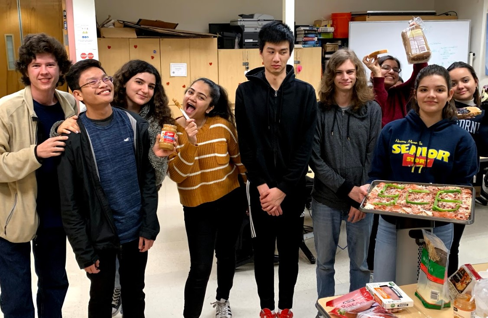
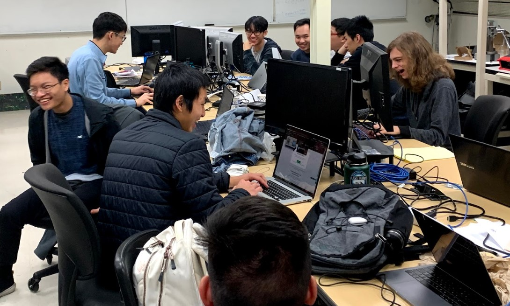
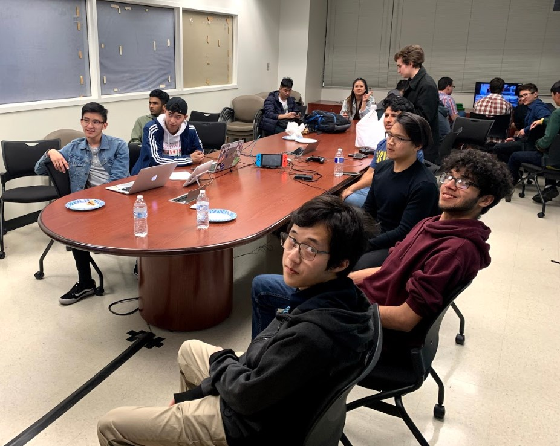

# SCE Blast Week 3 💘
Welcome to the third Blast Week weekly newsletter from SCE. 
We are announcing two BIG company tours this week so check out the details below.  

<a href="https://www.instagram.com/sjsusce/" target="_blank">

</a>

## [NEW] JavaScript Async Workshop w/ Evan

Join Evan Ugarte, SCE President, this Thursday where he will go over JavaScript Async concepts in a technical workshop this week. 
```
When: Thursday, February 20 2020 from 3:00pm - 4:00pm
Where: ENGR 292
```

## [JOIN] Competetive Programming Team
Looking for a place to sharpen your data structures and algorithms? Look no further! Join SJSU's competitive programming team to enhance your coding capabilities. All skills levels are welcome!


## [NEW] Hewlett Packard Enterprise Site Visit


```
When: Thursday, March 5 2020 from 11:00am - 1:00pm
Where: HPE HQ 6280 America Center Dr. San Jose, CA 
Limited spots, register fast!
Register HERE: https://hpe.recsolu.com/external/events/H9pbuNKlr_YVTH3lzQIdZg
```

## [NEW] Microsoft Company Tour

```
When: Wednesday, March 11 2020 from 8:30am - 1:00pm
Where: 1288 Pear Ave. Mountain View, CA
Limited spots, register fast!
Register HERE: https://docs.google.com/forms/d/e/1FAIpQLSduD5NCFxJDUguY0h1vXEhWbwCV9n08dSf4e2PwWsBPWtHlPg/viewform
Carpool: https://www.groupcarpool.com/t/9kug4i
```

## ✅ SCE Game Night & Potluck




## MEME OF THE WEEK 


>"A user interface is like a joke; If you have to explain it, it's not that good."

-Marin LeBlanc

[SCE Website](http://sce.engr.sjsu.edu/?fbclid=IwAR25WOB_jpB62Dxf8vJSzKmI_KaT4iLBfCuT7eCrwRCetb4orQtB_ek7RY0 "Title")

[Instagram @scesjsu](http://instagram.com/sjsusce)

[Facebook @scesjsu](https://www.facebook.com/sjsusce/)