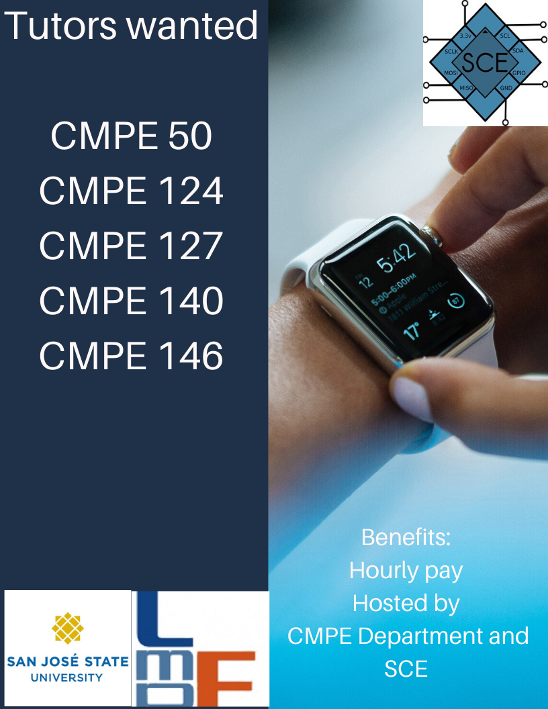
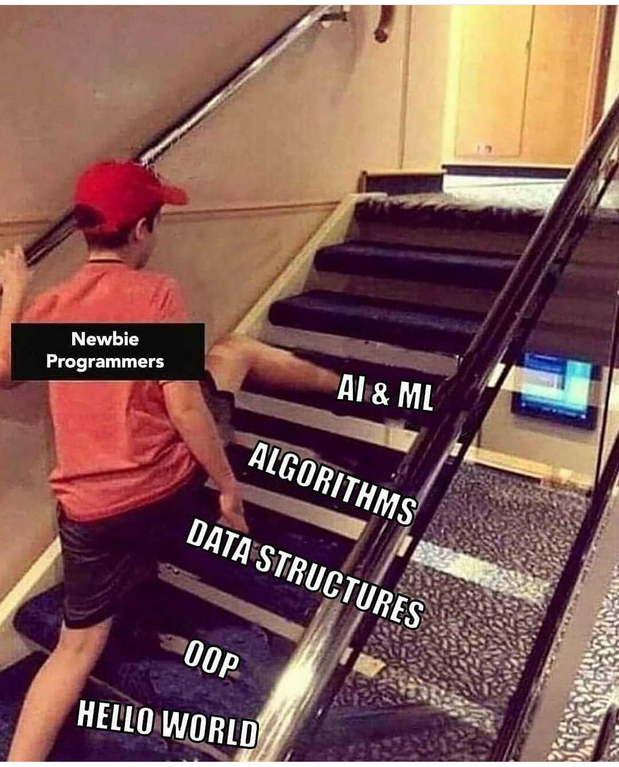

# SCE Blast Week 5 ☘
Welcome to the fifth Blast Week weekly newsletter from SCE. Yesterday (Saturday 2/29) we had an extra day for the 2020 leap year; see ya again in 2024. 
 
<a href="https://www.instagram.com/sjsusce/" target="_blank">

</a> follow @sjsusce

## [🐍Python Series] Searching Algorithms Workshop w/ Habib
Join Habib Sorathia this Thursday where he will be covering different searching algorithms like sequential and binary search. This is part of our Python algorithm series, where we prepare students for interview problems.
```
When: Thursday, March 5 2020 from 3:00pm - 4:00pm
Where: ENGR 292
Register here: https://docs.google.com/forms/d/e/1FAIpQLScTQiqTVrqhlxd4WAv0L6u1gET_eRQULWvaETPp2K-SLKSGEQ/viewform
```

## VOTE NOW @SJSU 
If your are over 18 years old and a registered voter, you can now start voting for the California Primary at SJSU. The voting center is found at the SJSU MLK Library first floor. The official day to vote is Tuesday March 3rd, 2020. 

## TUTORS WANTED FOR CMPE COURSES


## [NEW] SCE Hackathon 
SCE is currently planning to host a Hackathon event some time in April where we plan on having swag and prizes for the winners. If you are interested in the idea of this, please [fill this form](https://docs.google.com/forms/d/e/1FAIpQLSdcIn1d1wH-jk_W1D-xZTDr-t591r1BQEBvKi3di2iDJlZnhQ/viewform). 

## [NEW] Spider Workshop w/ Evan
Evan will be hosting a fun workshop about spiders on Tuesday 3/10 at 12pm. More info on this event and a signup sheet next week. 

## [JOIN] Competetive Programming Team
Looking for a place to sharpen your data structures and algorithms? Look no further! Join SJSU's competitive programming team to enhance your coding capabilities. All skills levels are welcome!


## MEME OF THE WEEK 


>"Design is not just what it looks like and feels like. Design is how it works."

-Steve Jobs

The S.oftware and C.omputer E.ngineering Society
Charles W. Davidson College of Engineering, 
E-294
San Jose State University

[SCE Website](http://sce.engr.sjsu.edu/?fbclid=IwAR25WOB_jpB62Dxf8vJSzKmI_KaT4iLBfCuT7eCrwRCetb4orQtB_ek7RY0 "Title")

[Instagram @scesjsu](http://instagram.com/sjsusce)

[Join SCE Discord Channel](https://discord.gg/e2Dsgd9)

[Facebook @scesjsu](https://www.facebook.com/sjsusce/)