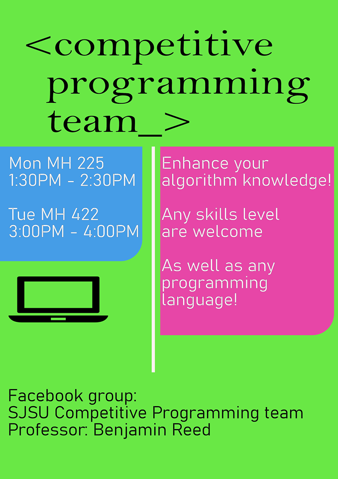
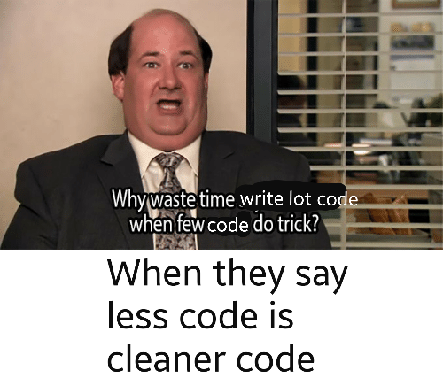

# SCE Blast Week 6 🍀
Welcome to the sixth Blast Week weekly newsletter from SCE. Daylight savings time was this Sunday which means we jumped 1 hour forward which means one less hour of sleep for you (yayy...😒). 
 
<a href="https://www.instagram.com/sjsusce/" target="_blank">

</a> follow @sjsusce

## [NEW] Spider Workshop w/ Evan
How much do you know about spiders? Probably not as much as you think. Join Evan in ENGR 292 this Tuesday where he will host a fun and informative workshop about spiders (yes those eight-legged creatures infamous for arahnaphoiba). Register HERE: https://tinyurl.com/rxozmhz  
```
When: Tuesday, March 10 2020 at 12:00pm
Where: ENGR 292
```
## [NEW] SCE Hackathon 
SCE is currently planning to host a Hackathon event some time in April where we plan on having swag and prizes for the winners. If you are interested in the idea of this, please [fill this form](https://tinyurl.com/vx2s2s3). 

## [NEW] Volunteers for Society of Women Engineers (SWE)
Every year, SJSU members get the chance to volunteer at the WOW! That's Engineering Conference, happening on April 11th, 2020 this year. Volunteering roles include being session moderators, group leaders and doing event set-up. If you are interested in being a volunteer, then please sign up on [THIS Google Form](https://docs.google.com/forms/d/e/1FAIpQLSdNPGiIG_m-8cwxVkm0kBtY-MKZ4r8ISABu1SGmr6x-yTRWIQ/viewform). We will get back to you with more specific roles and assignments as we approach the date of the conference. 

## TUTORS WANTED FOR CMPE COURSES


## [JOIN] Competetive Programming Team
Looking for a place to sharpen your data structures and algorithms? Look no further! Join SJSU's competitive programming team to enhance your coding capabilities. All skills levels are welcome!



## MEME OF THE WEEK 


>"Good artists copy, great artists steal."

-Pablo Picasso

The Software and Computer Engineering Society
Charles W. Davidson College of Engineering, 
E-294
San Jose State University

[SCE Website](http://sce.engr.sjsu.edu/?fbclid=IwAR25WOB_jpB62Dxf8vJSzKmI_KaT4iLBfCuT7eCrwRCetb4orQtB_ek7RY0 "Title")

[Instagram @scesjsu](http://instagram.com/sjsusce)

[Join SCE Discord Channel](https://discord.gg/e2Dsgd9)

[Facebook @scesjsu](https://www.facebook.com/sjsusce/)