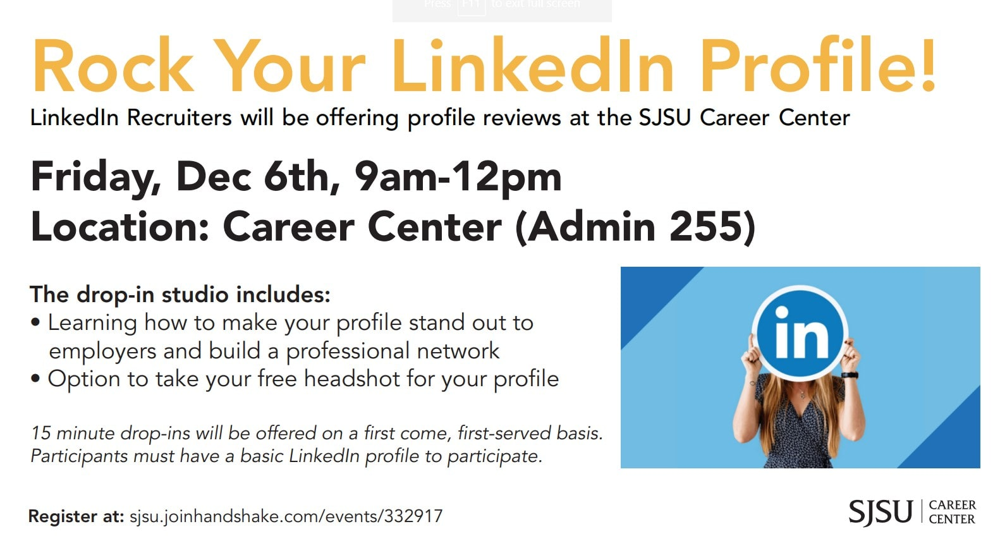
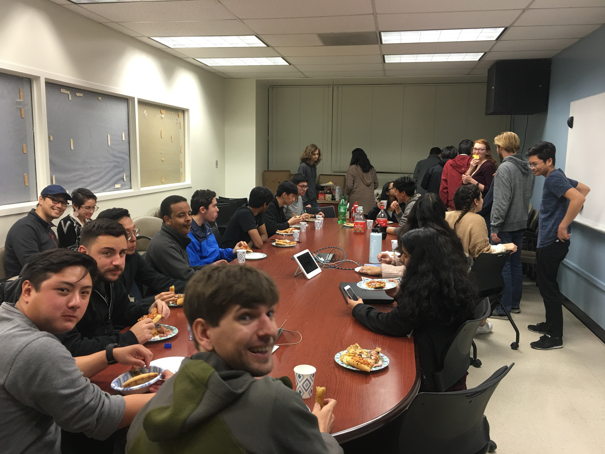
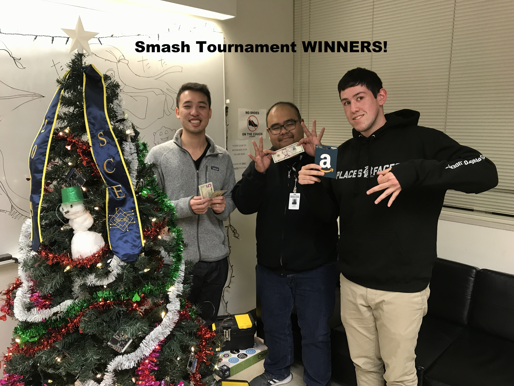
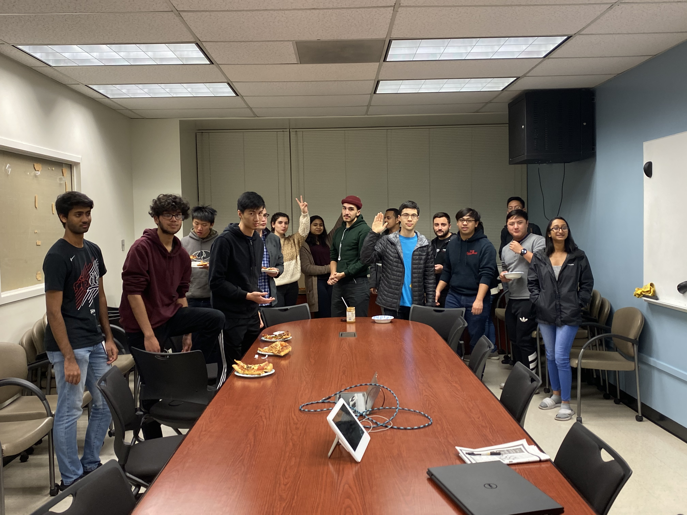

# SCE Blast Week 14 ❄

### [NEW] Career Center Rock Your Profile! Workshop

The Career Center is hosting its last LinkedIn Profile Studio of the semester. They will have several LinkedIn Recruiters in house to provide tips and critiques at this special event, two of which will be from the Campus Recruiting Tech team, and they are specifically looking to see Engineering students.

```
When: Friday December 6 2019 from 9:00 am - 12:00pm
Where: Career Center (ADMIN 255)
```



### Ethereum/Blockchain Workshop with Jeremy

Jeremy Chau, a graduating CMPE Masters student, will be giving a workshop on the Ethereum blockchain! He is well versed in the technology as he used it for his thesis project. (last weeks Blast email had the incorrect date)

Topics include:
- Smart contracts
- Using python to interact with the Etherium blockchain and make transactions

```
When: Monday November 25, 2019 from 12:00pm - 1:00pm 
Where: ENGR 292
```


### SCE Badminton Tournament @SRAC

We will be playing badminton at the rec center. Wanna play too? Go ahead and sign up at the RSVP form! There will be doubles and singles games, so don’t say you can’t come because you don’t have a partner. To add the “icing on the cake”, top 3 badminton teams/players will get a prize. 

```
Time: Tuesday November 26, 2019 from 12:00 - 2:00pm
Where: SRAC
What to bring: Rackets
``` 
Sign up [HERE](https://forms.gle/cawJDgfJ5xqjirRV6)

<a href="https://forms.gle/cawJDgfJ5xqjirRV6" target="newtab">HERE!</a> 


### ✅ Thanksgiving Potluck




